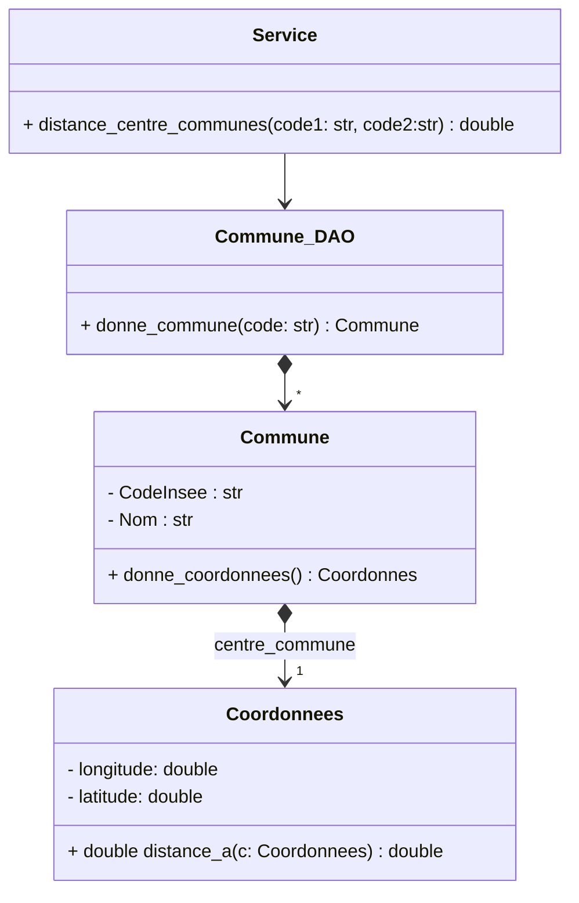
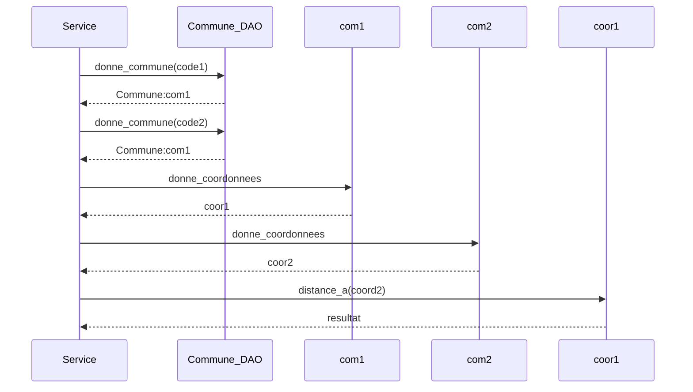

# Calcul de distance entre les centre de deux communes

## Vision globale
**entrée:** code Insee des deux communes -> chaines de 5 caractères

**sortie:** distance en km -> nombre réel

## Etapes
1. récupérer les coordonnées de la première commune
  - **entree:** code de la commune
  - **sortie:** longitude, latitude
2. récupérer les coordonnées de la seconde commune
  - **entree:** code de la commune
  - **sortie:** longitude, latitude
3. calculer la distance
  - **entree:** deux couples de coordonnées
  - **sortie:** distance en km

# Exemple d'implémentation

